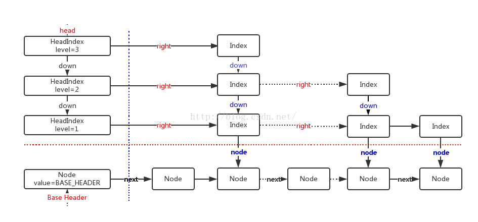

# background

二分查找要求元素可以随机访问，所以决定了需要把元素存储在连续内存。这样查找确实很快，但是插入和删除元素的时候，为了保证元素的有序性，就需要大量的移动元素了。

如果需要的是一个能够进行二分查找，又能快速添加和删除元素的数据结构，首先就是二叉查找树，二叉查找树在最坏情况下可能变成一个链表。

于是，就出现了平衡二叉树，根据平衡算法的不同有AVL树，B-Tree，B+Tree，红黑树等，但是AVL树实现起来比较复杂，平衡操作较难理解，这时候就可以用SkipList跳跃表结构。


 

# Key-Value数据结构
目前常用的key-value数据结构有三种：Hash表、红黑树、SkipList，它们各自有着不同的优缺点（不考虑删除操作）：
* Hash表：插入、查找最快，为O(1)；如使用链表实现则可实现无锁；数据有序化需要显式的排序操作。
* 红黑树：插入、查找为O(logn)，但常数项较小；无锁实现的复杂性很高，一般需要加锁；数据天然有序。
* SkipList：插入、查找为O(logn)，但常数项比红黑树要大；底层结构为链表，可无锁实现；数据天然有序。

如果要实现一个key-value结构，需求的功能有插入、查找、迭代、修改，那么首先Hash表就不是很适合了，因为迭代的时间复杂度比较高；而红黑树的插入很可能会涉及多个结点的旋转、变色操作，因此需要在外层加锁，这无形中降低了它可能的并发度。而SkipList底层是用链表实现的，可以实现为lock free，同时它还有着不错的性能（单线程下只比红黑树略慢），非常适合用来实现我们需求的那种key-value结构。

LevelDB、Reddis的底层存储结构就是用的SkipList。


```java
// Node节点，拥有key-value对
// 单链表，有序，第一个节点为head.node标记节点，中间可能会穿插些删除标记节点（即marker节点）
static final class Node<K,V> {
	final K key;
	volatile Object value; // value为Object类型，便于区分删除标记节点、head.node标记节点
	volatile Node<K,V> next;
 
	/**
	 * Creates a new regular node.
	 */
	Node(K key, Object value, Node<K,V> next) {
		this.key = key;
		this.value = value;
		this.next = next;
	}
 
	// 创建一个删除标记节点
	// 删除标记节点的value为this，以区分其他Node节点；
	// key为null，其他场合会用到，但不能用作区分，因为head.node的key也为null
	Node(Node<K,V> next) {
		this.key = null;
		this.value = this;
		this.next = next;
	}
 
	// CAS value属性
	boolean casValue(Object cmp, Object val) {
		return UNSAFE.compareAndSwapObject(this, valueOffset, cmp, val);
	}
 
	// CAS next属性
	boolean casNext(Node<K,V> cmp, Node<K,V> val) {
		return UNSAFE.compareAndSwapObject(this, nextOffset, cmp, val);
	}
 
	// 是否为删除标记节点
	boolean isMarker() {
		return value == this;
	}
 
	// 是否为header node节点
	boolean isBaseHeader() {
		return value == BASE_HEADER;
	}
 
	// 在当前Node节点后增加删除标记节点（采用CAS next方式实现）
	boolean appendMarker(Node<K,V> f) {
		return casNext(f, new Node<K,V>(f));
	}
 
	 // 推进删除Node节点
	 // 一般在遍历过程中，如果遇到当前Node的value为null，会调用该方法
	void helpDelete(Node<K,V> b, Node<K,V> f) {
		// 首先检查当前的链接是否为b——>this——>f;
		// 再进行推进删除，过程分两步，每一步都采用CAS实现
		// 每次只推进一步，以减小推进线程间的干扰
		if (f == next && this == b.next) { // 检测是否为b——>this——>f，其中b为前驱节点，f为后继节点
			if (f == null || f.value != f) // 待删除节点未进行标记
				appendMarker(f);// 链接删除标记节点
			else
				b.casNext(this, f.next); // 删除当前节点及其删除标记节点，完成删除
		}
	}
 
	// 获取节点的有效value
	V getValidValue() {
		Object v = value;
		if (v == this || v == BASE_HEADER) // 若为删除标记节点、header node节点，则返回null
			return null;
		return (V)v;
	}
 
	// 对有效键值对封装到不可变的Entry
	AbstractMap.SimpleImmutableEntry<K,V> createSnapshot() {
		V v = getValidValue();
		if (v == null)
			return null;
		return new AbstractMap.SimpleImmutableEntry<K,V>(key, v);
	}
 
	// UNSAFE mechanics
 
	private static final sun.misc.Unsafe UNSAFE;
	private static final long valueOffset;
	private static final long nextOffset;
 
	static {
		try {
			UNSAFE = sun.misc.Unsafe.getUnsafe();
			Class k = Node.class;
			valueOffset = UNSAFE.objectFieldOffset
				(k.getDeclaredField("value"));
			nextOffset = UNSAFE.objectFieldOffset
				(k.getDeclaredField("next"));
		} catch (Exception e) {
			throw new Error(e);
		}
	}
}
 
// 索引节点，用于从最上层往下缩小查找范围
// 逻辑上的双链表，非前后链接，而是上下链接
static class Index<K,V> {
	final Node<K,V> node; // 索引节点是基于Node节点的
	final Index<K,V> down;// down为final的，简化并发
	volatile Index<K,V> right;
 
	/**
	 * Creates index node with given values.
	 */
	Index(Node<K,V> node, Index<K,V> down, Index<K,V> right) {
		this.node = node;
		this.down = down;
		this.right = right;
	}
 
	// CAS right属性
	final boolean casRight(Index<K,V> cmp, Index<K,V> val) {
		return UNSAFE.compareAndSwapObject(this, rightOffset, cmp, val);
	}
 
	// 其Node节点是否删除
	final boolean indexesDeletedNode() {
		return node.value == null;
	}
 
	// 链接Index节点
	// 如果链接过程中，其Node节点已删除，则不链接，以减小与解链接的CAS竞争
	/*
	 * @param succ the expected current successor
	 * @param newSucc the new successor
	 * @return true if successful
	 */
	final boolean link(Index<K,V> succ, Index<K,V> newSucc) {
		Node<K,V> n = node;
		newSucc.right = succ; // 将newSucc链接进来
		return n.value != null && casRight(succ, newSucc); // CAS right
	}
 
	// 解链接index节点，如果其Node已删除，则解链接失败
	/**
	 * @param succ the expected current successor
	 * @return true if successful
	 */
	final boolean unlink(Index<K,V> succ) {
		return !indexesDeletedNode() && casRight(succ, succ.right);// CAS right
	}
 
	// Unsafe mechanics
	private static final sun.misc.Unsafe UNSAFE;
	private static final long rightOffset;
	static {
		try {
			UNSAFE = sun.misc.Unsafe.getUnsafe();
			Class k = Index.class;
			rightOffset = UNSAFE.objectFieldOffset
				(k.getDeclaredField("right"));
		} catch (Exception e) {
			throw new Error(e);
		}
	}
}
 
// HeadIndex节点，跟踪索引层次
static final class HeadIndex<K,V> extends Index<K,V> {
	final int level;// 索引层，从1开始，Node单链表层为0
	HeadIndex(Node<K,V> node, Index<K,V> down, Index<K,V> right, int level) {
		super(node, down, right);
		this.level = level;
	}
}
```


# 增、改

步骤：

* 查找比key小的前驱节点，查找过程中删除待删除Node节点的索引节点；
* 从前驱节点开始，遍历底层Node单链表，若已存在相关的key-value对，则CAS替换新的value，返回旧value；若不存在，则确定插入位置；遍历过程中，推进删除待删除的Node节点；
* 用key、value创建新的Node节点，用CAS next方式链接进来；
* 给新的Node节点随机生成一个索引层次，若层次大于0，则给其增加索引节点，返回null。

```java
public V put(K key, V value) {
	if (value == null)
		throw new NullPointerException();
	return doPut(key, value, false);
}
 
private V doPut(K kkey, V value, boolean onlyIfAbsent) {
	Comparable<? super K> key = comparable(kkey);
	for (;;) {
		Node<K,V> b = findPredecessor(key); // 找到前驱节点后，接下来就是在Node单链表层精确找到插入位置
		Node<K,V> n = b.next;
		for (;;) {
			// 遍历清除Node节点操作同findNode
			if (n != null) {
				Node<K,V> f = n.next;
				if (n != b.next) 
					break;
				Object v = n.value;
				if (v == null) { 
					n.helpDelete(b, f); 
					break;
				}
				if (v == n || b.value == null)
					break;
				int c = key.compareTo(n.key);
				if (c > 0) { // key大于n，继续往后找
					b = n;
					n = f;
					continue;
				}
				if (c == 0) { // 已有相关的key-value对
					if (onlyIfAbsent || n.casValue(v, value))
						return (V)v;
					else
						break; // CAS value失败，则重新开始，失败原因可能是n变成了待删除节点或有其他修改线程修改过
				}
				// else c < 0; fall through：说明新增的key-value对需要插到b和n之间
			}
 
			Node<K,V> z = new Node<K,V>(kkey, value, n);
			if (!b.casNext(n, z)) // 将新节点z插入b、n之间
				break;         // 失败了，原因同n != b.next，重来
			int level = randomLevel(); // 给新增的Node节点随机生成一个索引层次
			if (level > 0)
				insertIndex(z, level); // 给z增加索引节点
			return null;
		}
	}
}
 
// 查找比key小的前驱节点，若没有，则返回head.node
// 一些操作依赖该方法删除索引节点
private Node<K,V> findPredecessor(Comparable<? super K> key) {
	if (key == null)
		throw new NullPointerException(); // don't postpone errors
	for (;;) {
		Index<K,V> q = head;
		Index<K,V> r = q.right;
		// 从索引层最上层开始，往右往下，
		// 一直找到最下层索引层（即第一层），从而确定查找范围，以在底层Node单链表遍历精确找到
		for (;;) {
			if (r != null) { // 在索引层，往右找
				Node<K,V> n = r.node;
				K k = n.key;
				if (n.value == null) { // 遍历到待删除节点n的索引节点
					if (!q.unlink(r))// 删除其索引节点（采用CAS right属性）
						//删除失败原因：q被标记为待删除节点或在q后增加新索引节点或已删除了其right节点
						break;   // 重新开始
					r = q.right;// 若删除成功，则获取新的right索引节点，继续找
					continue;
				}
				if (key.compareTo(k) > 0) { // 若key大，说明可能还有小于key的更大的，继续找
					q = r;
					r = r.right;
					continue;
				}
			}
			Index<K,V> d = q.down;// 当层索引层没有，则往下一层找，进一步缩小查找范围
			if (d != null) {// 在下一层索引层，继续找
				q = d;
				r = d.right;
			} else
				return q.node;// 确定前驱节点，如果没有则为head.node标记节点
		}
	}
}
 
// 给新增的Node节点随机生成一个索引层次
/**
     * Returns a random level for inserting a new node.
     * Hardwired to k=1, p=0.5, max 31 (see above and
     * Pugh's "Skip List Cookbook", sec 3.4).
     *
     * This uses the simplest of the generators described in George
     * Marsaglia's "Xorshift RNGs" paper.  This is not a high-quality
     * generator but is acceptable here.
     */
private int randomLevel() {
	int x = randomSeed;
	x ^= x << 13;
	x ^= x >>> 17;
	randomSeed = x ^= x << 5;
	if ((x & 0x80000001) != 0) // test highest and lowest bits
		return 0;
	int level = 1;
	while (((x >>>= 1) & 1) != 0) ++level;
	return level;
}
 
// 为Node节点添加索引节点
/**
     * @param z the node
     * @param level the level of the index
     */
private void insertIndex(Node<K,V> z, int level) {
	HeadIndex<K,V> h = head;
	int max = h.level; // head的索引层次是最大的
 
	if (level <= max) { // 待添加索引节点的索引层次在head索引层次内，创建索引节点添加进来即可
		Index<K,V> idx = null;
		for (int i = 1; i <= level; ++i)
			idx = new Index<K,V>(z, idx, null);// 索引节点，从下往上链接
		addIndex(idx, h, level);               // 将索引节点链接进来
 
	} else { // 增加一层索引层，需要new新层次的HeadIndex
		/*
		 * To reduce interference by other threads checking for
		 * empty levels in tryReduceLevel, new levels are added
		 * with initialized right pointers. Which in turn requires
		 * keeping levels in an array to access them while
		 * creating new head index nodes from the opposite
		 * direction.
		 */
		level = max + 1;
		Index<K,V>[] idxs = (Index<K,V>[])new Index[level+1];
		Index<K,V> idx = null;
		for (int i = 1; i <= level; ++i)
			idxs[i] = idx = new Index<K,V>(z, idx, null);
 
		HeadIndex<K,V> oldh;
		int k;
		for (;;) {
			oldh = head;
			int oldLevel = oldh.level;
			if (level <= oldLevel) { // 其他线程增加过索引层
				k = level;
				break;               // 同上面的level <= max情况处理
			}
			HeadIndex<K,V> newh = oldh;
			Node<K,V> oldbase = oldh.node;
			for (int j = oldLevel+1; j <= level; ++j) // 有可能其他线程删除过索引层，所以从oldLevel至level增加HeadIndex
				newh = new HeadIndex<K,V>(oldbase, newh, idxs[j], j); // 创建新层次的HeadIndex且将索引节点idxs相应层次链接进来
			if (casHead(oldh, newh)) { // CAS head HeadIndex节点
				k = oldLevel;
				break;
			}
		}
		addIndex(idxs[k], oldh, k);                  // 需要将idxs的旧oldLevel层次及下面的索引链接进来
	}
}
 
/**
 * 从第indexLevel层往下到第1层，将索引节点链接进来
 * @param idx the topmost index node being inserted
 * @param h the value of head to use to insert. This must be
 * snapshotted by callers to provide correct insertion level
 * @param indexLevel the level of the index
 */
private void addIndex(Index<K,V> idx, HeadIndex<K,V> h, int indexLevel) {
	// Track next level to insert in case of retries
	int insertionLevel = indexLevel;
	Comparable<? super K> key = comparable(idx.node.key);
	if (key == null) throw new NullPointerException();
 
	// 过程与findPredecessor类似, 只是多了增加索引节点
	for (;;) {
		int j = h.level;
		Index<K,V> q = h;
		Index<K,V> r = q.right;
		Index<K,V> t = idx;
		for (;;) {
			if (r != null) {// 在索引层，往右遍历
				Node<K,V> n = r.node;
				// compare before deletion check avoids needing recheck
				int c = key.compareTo(n.key);
				if (n.value == null) { 
					if (!q.unlink(r))
						break;
					r = q.right;
					continue;
				}
				if (c > 0) {
					q = r;
					r = r.right;
					continue;
				}
			}
 
			if (j == insertionLevel) {        // 可以链接索引节点idx
				if (t.indexesDeletedNode()) { // 索引节点的Node节点被标记为待删除节点
					findNode(key);            // 推进删除索引节点及其Node节点
					return;                   // 不用增加索引节点了
				}
				if (!q.link(r, t))            // 将第insertionLevel层索引节点链接进来
					//删除失败原因：同findPredecessor种的q.unlink(r)
					break; 				 	  // 链接失败，重新开始
				if (--insertionLevel == 0) {  // 准备链接索引节点idx的下一层索引
					if (t.indexesDeletedNode()) // 返回前再次检查索引节点t是否被标记为待删除节点，以进行清理工作
						findNode(key);
					return;                   // insertionLevel==0表明已经完成索引节点idx的链接
				}
			}
 
			if (--j >= insertionLevel && j < indexLevel) // 已链接过索引节点idx的第insertionLevel+1层
				t = t.down;                              // 准备链接索引节点idx的第insertionLevel层
			q = q.down;						  // 准备链接索引节点idx的下一层索引
			r = q.right;
		}
	}
}
 
// 查找相关key的Node，没有则返回null。
// 遍历Node单链表中，清除待删除节点
// 在doPut、doRemove、findNear等都包含这样的遍历清除操作
// 不能共享这样的清除代码，因为增删改查需要获取Node链表顺序的快照暂存到自身的局部变量，用于并发
// 一些操作依赖此方法删除Node节点
private Node<K,V> findNode(Comparable<? super K> key) {
	for (;;) {
		Node<K,V> b = findPredecessor(key); // 获取key的前驱节点
		Node<K,V> n = b.next;
		for (;;) {
			if (n == null)
				return null;
			Node<K,V> f = n.next;
			// 不是连续的b——>n——>f快照，不能进行后续解链接待删除节点
			//变化情况：在b后增加了新节点或删除了其next节点或增加了删除标记节点以删除b，
			if (n != b.next)              
				break; // 重新开始
			Object v = n.value;
			if (v == null) {           // n为待删除节点
				n.helpDelete(b, f);    // 推进删除节点n
				break;                 // 重新开始
			}
			// 返回的前驱节点b为待删除节点
			// 这里不能直接删除b，因为不知道b的前驱节点，只能重新开始，调用findPredecessor返回更前的节点
			if (v == n || b.value == null)  // b is deleted
				break;                 // 重新开始
			int c = key.compareTo(n.key);
			if (c == 0)
				return n;
			if (c < 0)
				return null;
			b = n;
			n = f;
		}
	}
}

```


[JDK容器与并发—Map—ConcurrentSkipListMap](https://blog.csdn.net/architect0719/article/details/51136555) 

[跳表（SkipList）及ConcurrentSkipListMap源码解析
](https://blog.csdn.net/sunxianghuang/article/details/52221913) 