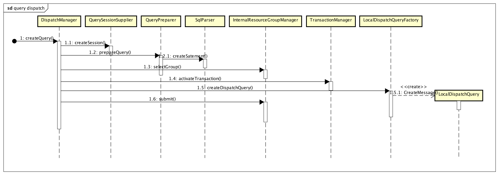

# coordinator_code_analysis

[Presto 源码分析：Coordinator 篇](https://www.infoq.cn/article/VNe0A9yKszPCmp32akCa)

# Presto 源码分析：Coordinator 篇

- 邝国燊

- 张之栋

发布于：2019 年 12 月 21 日 08:00

Presto 是一个开源的分布式 SQL 查询引擎，适用于对 GB 到 PB 量级的数据源进行交互式查询。Presto 的服务器可以分为两种类型：coordinator 和 worker。Coordinator 负责解析查询语句，制定执行计划，和管理 worker 节点。而 worker 负责具体任务的执行和数据处理。

本文首先简要介绍了 Presto 的服务器的启动流程，然后以一个查询请求的处理过程为线索，分析了 coordinator 对查询的处理流程。整个分析以 [323 版本的 PrestoSQL 代码](https://github.com/prestosql/presto/tree/323)为基础.

## 1\. 服务端启动

### 1.1 相关类

Presto 的服务器端启动流程涉及到的类主要有 3 个：

- PrestoServer：服务端入口
- ServerMainModule：服务端的主要依赖注入配置
- CoordinatorModule：Coordinator 的依赖注入配置

### 1.2 流程

PrestoServer 作为服务端的运行入口，在其 run 函数中，进行一系列的依赖注入配置，其中最主要的配置在 ServerMainModule 中。ServerMainModule 针对服务端是否被配置为 Coordinator/Worker，分别使用 CoordinatorModule 和 WorkerModule 进行配置。

## 2\. Coordinator

Coordinator 负责接受用户提交的查询请求，对这些请求进行分析，并调度到不同的 worker 节点上执行。

### 2.1 用户执行查询相关 Restful 接口

用户执行查询相关的 Restful 接口，在类 QueuedStatementResource 和 ExecutingStatementResource 中实现。

从用户的角度看来，一个数据库查询在结束前主要经历两个状态，Queued（已提交，排队中）和 Executing（执行中）。对于处于不同状态的查询，Presto 把相关的 Restful 接口放在两个类中：

QueuedStatementResource 类负责处理处于 Queued 状态的查询，主要接口有：

- postStatement（POST /v1/statement）：提交一个新的查询，若成功，会返回新查询的 id，nextUri，和新查询的状态等。其中，nextUri 可以直接用于下面的 getStatus 和 cancelQuery 接口；
    
- getStatus（GET /v1/statement/queued/{queryId}/{slug}/{token}）：获取查询当前的状态，返回的响应中包含一个 nextUri。根据查询的当前状态，这个 nextUri 的路径以 /v1/statement/queued 或者 /v1/statement/executing 为前缀。当以 /v1/statement/queued 为前缀时，可以用于重复调用 getStatus 接口或 cancelQuery 接口。当以 /v1/statement/executing 为前缀时，可以用于调用 ExecutingStatementResource 的相关接口；
    
- cancelQuery（DELETE /v1/statement/queued/{queryId}/{slug}/{token}）：取消已经提交的查询；
    

ExecutingStatementResource 类负责处理处于 Executing 状态的查询，主要接口有：

- getQueryResults（GET /v1/statement/executing/{queryId}/{slug}/{token}）：获取查询结果，响应中，主要的元素有 nextUri（用于进一步调用 getQueryResults 接口或 cancelQuery 接口），partialCancelUri（用于取消已经部分执行的查询，即下面的 cancelPartial 接口），columns（结果的列信息），data（查询结果数据）；
- cancelQuery（DELETE /v1/statement/executing/{queryId}/{slug}/{token}）：用于取消已经处于 Executing 的查询；
- partialCancel（DELETE /v1/statement/partialCancel/{queryId}/{stage}/{slug}/{token}）：用于取消已经部分执行的查询；

### 2.2 查询的总体执行流程

基于在 2.1 节中介绍的 Restful 接口，一个查询的总体执行流程如图 1 所示，分为以下几个步骤：  


图 1 查询的总体执行流程

  

1. 用户通过 postStatement 接口提交一个查询请求，QueuedStatementResource 接受到该请求后，创建一个 Query 对象维护该请求的状态，Query 对象的创建过程中，会请求 DispatchManager 分配一个全局唯一的 queryId；
    
2. Query 创建后，QueuedStatementResource 立即请求它的 getQueryResults 方法，此时由于 DispatchManager 仅仅只是为该查询分配了 ID, 而尚未进行分发，因此会立即返回一个 nextUri（queuedUri），这个 nextUri 指向的其实就是 QueuedStatementResource 的 getStatus 接口；
    
3. 用户通过上一步的 nextUri 调用 getStatus 接口之后，实际上调用的是 Query 对象的 waitForDispatched 接口，该接口则请求 DispatchManager 新建一个查询，并等待查询被分发，一旦分发完成，则返回一个 nextUri（executingUri），这个 nextUri 指向的其实就是 ExecutingStatementResource 的 getQueryResults 接口；
    
4. 一旦 getQueryResults 接口被调用，ExecutingStatementResource 将创建一个 protocol.Query 对象以维护查询状态，并异步调用该对象的 waitForResults 以获取查询结果，当查询结果未就绪或者未全部返回，getQueryResults 仍然会返回一个 nextUri（executingUri），用户可以通过这个 nextUri 循环获取所有结果数据。
    

### 2.3 分发查询

从 2.2 节我们可以看到，一个查询最后是在 DispatchManager 的主导下进行分发。展示了 DispatchManager 进行分发的具体步骤。



图 2 查询的分发过程

  

从图 2 可以看到，查询的分发过程如下：

1. 首先，DispatchManager 请求 QuerySessionSupplier，为查询创建一个 session；
    
2. 请求 QueryPreparer，进而请求 SqlParser，对查询语句进行语法分析，得到一个已解析的查询语句 preparedQuery；
    
3. 请求 InternalResourceGroupManager，为查询分配一个资源组 InternalResourceGroup，用于执行查询；
    
4. 进行必要的事务相关处理；
    
5. 当上述步骤完成之后，DispatchManager 将前面几步产生的 session，preparedQuery，resourceGroup（实际上是 ResrouceGroup 的 ID）等，通通放入一个 LocalDispatchQuery 对象中；
    
6. 将 LocalDispatchQuery 对象提交给 InternalResourceGroupManager 执行；
    

需要说明的是，目前 Presto 只有一个 InternalResourceGroup，其 ID 为 GLOBAL，所以所有查询都会使用该资源组。

### 2.4 查询的执行

从 2.3 节可以看到，封装了查询的 session，preparedQuery，resourceGroup 的 LocalDispatchQuery，最后是被 submit 到了 InternalResourceGroupManager。接下来，可以算是查询真正开始被执行了。图 3 展示了这个过程。


图 3 查询的执行

  

图 3 的查询执行过程大致可以分为 3 个阶段：

第一阶段：LocalDispatchQuery 创建时，其实也同时创建了另外两个对象，一个是查询的状态机 QueryStateMachine，另一个则是 SqlQueryExecution。从名字很容易猜到，QueryStateMachine 记录当前查询的状态。而 SqlQueryExecution 则是封装了与 Sql 执行相关的对象，包括 SqlQueryExecution 创建时被同时创建的 Analyzer，以及下面第二阶段创建的 LogicalPlanner，DistributedExecutionPlanner 和 SqlQueryScheduler。

第二阶段：LocalDispatchQuery 被提交到 InternalResourceGroupManager 之后，后者实际上是调用 InternalResourceGroup 的 run 方法，让 LocalDispatchQuery 在资源组上面执行。这个阶段，会通过 ClusterSizeMonitor 等待足够数量的 worker，然后依次创建 LogicalPlanner，DistributedExecutionPlanner 和 SqlQueryScheduler。依靠这 3 个类，以及 PlanFragmenter，Presto 生成查询的执行计划，并根据计划将查询分发到不同的 Worker 节点上执行。

第三阶段：SqlQueryScheduler 在查询完成之后，通知 QueryStateMachine，并进一步通知 InternalResourceGroup，查询已经完成。

从上面的描述，可以看到，整个过程的关键是第二阶段。第二阶段的 LogicalPlanner，PlanFragmenter，DistributedExecutionPlanner 和 SqlQueryScheduler 这几个类，完成了查询计划的生成，到查询的执行这一系列过程，下面是这几个类的简要介绍：

- LogicalPlanner：负责生成逻辑执行计划；
    
- PlanFragmenter：将 LogicalPlanner 生成的逻辑执行计划，拆分为多个子计划；
    
- DistributedExecutionPlanner：将 PlanFragmenter 拆分好的子计划，进一步拆分成可以分配到不同 Worker 节点上运行的 Stage；
    
- SqlQueryScheduler：将 Stage 调度到不同的 Worker 节点上运行；
    

### 2.5 查询执行过程的进一步分析

2.1 到 2.4 节主要是以用户向 Presto 提交查询语句作为一个分析的入口，分析了查询如何被 Presto 处理的大体流程。从前面的分析，我们可以知道，一个 SQL 查询，首先被 2.3 节的 SqlParser 解析器处理，接下来依次经过 LogicalPlanner，PlanFragmenter，DistributedExecutionPlanner，生成一个分布式的执行计划，最后被 SqlQueryScheduler 调度到不同的节点上执行。本节将依照这个处理流程，分析其每个阶段的输入和输出。

为了分析这个流程，本节将结合一个具体的例子，假定我们的 Presto 连接到了一个 MySQL 数据库（catalog 的名字为 test），MySQL 数据库上面有一个 Database，其名字为 db，db 中有一个名为 tab 的表。展示了 db 和 tab 的创建脚本。


图 4 测试数据库的初始化脚本

  

然后我们向 Presto 提交一个查询：

复制代码

```
select col1 from test.db.tab 
```

#### 2.5.1 SQL 的解析

Presto 使用了 [ANTLR4](https://github.com/antlr/antlr4) （一款开源的语法分析器生成工具）生成了 Presto 的 SQL 解析器 SqlBaseParser（相关的语法定义在 SqlBase.g4 文件里面）。2.3 节中提到的 SqlParser，首先调用了 SqlBaseParser 对我们提交的查询语句进行解析，生成 ANTLR4 形式的 AST（抽象语法树），然后再使用 AstVisitor 类，从树根开始，遍历这个 AST，生成一个 Presto 用自己的类表达的语法树。图 5 是从 SqlBase.g4 文件中，抽出的跟我们的示例查询相关的语法定义。而图 6 是我们例子中的查询语句生成的对应的语法树。

从图 5 和图 6 可以看到，图 6 这棵语法树跟图 5 的语法定义，基本上是对应的。这棵树的根节点是一个 Query 类的对象，对应的是语法定义中的 query 定义。它有一个成员 body，指向一个 QuerySpecification 对象，对应语法定义中的 querySpecification。而 QuerySpecification 有一个 select 成员，指向一个 Select 类的对象，Select 类中有 selectItems 成员，对应语法定义中 querySpecification 里面可能出现的多个 selectItem，以此类推。


图 5 示例查询相关的 ANTLR4 语法定义

  


图 6 示例查询对应的语法树

  

#### 2.5.2 逻辑执行计划的生成

一旦图 6 的语法树已经生成，LogicalPlanner 将会据此生成逻辑执行计划。这个阶段分为两步执行，首先，LogicalPlanner 对图 6 的语法树进行从根节点开始的递归遍历，生成一个未经优化的逻辑计划，如图 7 所示。图 7 中的表遍历节点 TableScanNode 是在遍历到图 6 的 Table 节点时生成的，4 个映射节点 ProjectNode，靠近 TableScanNode 的两个是在遍历 QuerySpecification 节点时生成的，另外两个是在遍历 Query 节点时生成的。最后的 OutputNode，是遍历完语法树之后，再生成的输出节点。


图 7 示例查询对应的逻辑执行计划

  

可以看到，未经优化的逻辑计划，其实包含非常多冗余的 ProjectNode，这时候，LogicalPlanner 会进行第二步：对计划进行一系列的优化。在 LogicalPlanner 类中，有一个 planOptimizers 列表，其中的每一个元素是一个优化器接口 PlanOptimizer 的实现。每个 PlanOptimizer 的实现都带有一个重写器 Rewriter，用于对逻辑计划进行递归遍历，重写出新的，优化后的逻辑计划。LogicalPlanner 循环地对上一步生成的逻辑计划应用 planOptimizers 列表的每一个优化器，最终得到图 8 所示的优化过的执行计划。


图 8 示例查询对应的优化后的逻辑执行计划

  

对于我们的示例查询在第一步生成的逻辑执行计划，真正生效的优化器只有两个：一个是 IterativeOptimizer，另外一个是 AddExchanges。IterativeOptimizer 将逻辑计划中冗余的 ProjectNode 全部去掉了，这是 IterativeOptimizer 对 RemoveRedundantIdentityProjections 规则的应用。而 AddExchanges 优化器在 OutputNode 和 TableScanNode 之间，加上了一个 ExchangeNode，用于在不同节点之间交换查询数据。

去掉冗余的 ProjectNode 的好处是显而易见的：去掉多余的 ProjectNode 可以提高查询的执行效率。而之所以需要增加 ExchangeNode，是因为我们的最终输出 OutputNode 需要在 Coordinator 上执行，而 TableScanNode 则一般需要调度到 Worker 上执行，所以两者之间，需要加上一个 ExchangeNode 以交换数据。

#### 2.5.3 执行计划的拆分

Presto 接下来会通过 PlanFragmenter 对优化后的逻辑执行计划进行拆分，分为若干个子计划 SubPlan。并不例外，这也是对优化后的逻辑执行计划进行自顶向下的再一次递归遍历完成的。


图 9 拆分后的子计划

  

图 9 是拆分好的子计划，可以看到，图 8 中的逻辑执行计划被拆分为两个子计划。对于图 8 的逻辑计划，Presto 的拆分的逻辑是，将 ExchangeNode 转换为 RemoteSourceNode，然后为 ExchangeNode 的 sources 中的每个元素，新建一个子计划 SubPlan。在 2.5.4 节中我们将会看到，这么拆分可以使 DistributedExecutionPlanner 将 ExchangeNode 的 sources 对应的每一个 SubPlan 转换为一个 Stage，然后分发到不同的 Worker 上执行。

#### 2.5.4 分布式执行计划的生成

接下来，DistributedExecutionPlanner 将上一小节拆分好的子计划，转换为分布式执行计划。DistributedExecutionPlanner 的转换逻辑是：将每一个 SubPlan 转换为一个 StageExecutionPlan。所以从图 10 可以看到，分布式执行计划与图 9 的拆分后的子计划是非常相似的。区别在于，对于那些 fragment 里面存在 TableScanNode 的 StageExecutionPlan，它会额外维护一个 splitSources。SplitSource 定义了一个表如何被划分成若干个 Batch，以便于后续并行处理。


图 10 分布式执行计划

  

#### 2.5.5 执行计划的调度

接下来进入的是执行计划的实际调度阶段，流程如图 11 所示。  


图 11 执行计划的调度

  

SqlQueryScheduler 在创建的时候，会为图 10 的分布式执行计划中的每一个 StateExecutionPlan 创建一个对应的 SqlStageExecution 对象和对应的 StageScheduler（为了保持简洁，图 11 仅展示了一个 SqlStageExecution 和一个 StageScheduler，但实际上，对应我们的示例查询，SqlStageExecution 和 StageScheduler 应该各有两个，分别对应图 10 的两个 StateExecutionPlan。并且 SqlQueryScheduler 创建的是 StageScheduler 子类的实例，分别是 FixedCountScheduler 和 SourcePartitionedScheduler）。

此后，SqlQueryScheduler 通过 AllAtOnceExecutionPolicy，创建 AllAtOnceExecutionSchedule。AllAtOnceExecutionSchedule 在 SqlQueryScheduler 调用其 getStagesToSchedule 时，会一次性返回全部未调度的 SqlStageExecution 的集合。SqlQueryScheduler 接下来会遍历这个集合，并调用集合中每个 SqlStageExecution 对应的 StageScheduler 的 schedule 方法，这个方法最终会调用到 SqlStageExecution 的 scheduleTask。 scheduleTask 将会创建 HttpRemoteTask，并通过 HttpRemoteTask，以 Restful 的方式，将 Stage 发送到 worker 节点。此后的执行，将会在 worker 上处理。

## 3\. 总结

在 Presto 中，coordinator 负责接受查询请求，解析请求，生成执行计划并将计划拆分和调度到 worker 上执行。本文结合代码，分析了这个流程。

**作者介绍：**

邝国燊，目前就职于广发证券股份有限公司信息技术部创新实验室，曾先后任职于 TP-LINK 和腾讯研究院，主要关注领域为数据库和分布式架构。