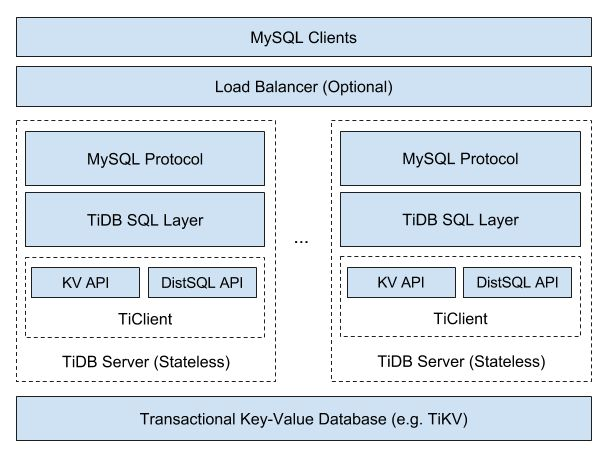
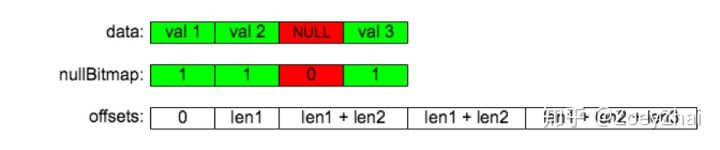

# overview 

TiDB 本质上是一个更加正统的 Spanner 和 F1 实现，并不 CockroachDB 那样选择将 SQL 和KV 融合，而是像 Spanner 和 F1 一样选择分离。

和 Spanner 一样，TiDB 是一个无状态的 MPP SQL Layer ，整个系统的底层是依赖 TiKV 来提供分布式存储和分布式事务的支持，TiKV 的分布式事务模型采用的是 Google Percolator 的模型，但是在此之上做了很多优化， Percolator 的优点是去中心化程度非常高，整个继续不需要一个独立的事务管理模块，事务提交状态这些信息其实是均匀分散在系统的各个 key 的 meta 中，整个模型唯一依赖的是一个授时服务器，在我们的系统上，极限情况这个授时服务器每秒能分配 400 w以上个单调递增的时间戳，大多数情况基本够用了（毕竟有 Google 量级的场景并不多见），同时在 TiKV 中，这个授时服务本身是高可用的，也不存在单点故障的问题。

[申砾：细说分布式数据库的过去、现在与未来](https://zhuanlan.zhihu.com/p/26676711)

# 基于Percolator实现分布式事务

Percolator的实现采用的是两阶段提交＋MVCC

Google为了解决网页索引的增量处理，以及维护数据表和索引表的一致性问题，基于BigTable实现了一个支持分布式事务的存储系统。支持snapshot isolation隔离级别，这个隔离级别不在ANSI定义的隔离级别范围内。

缺点是有write skew问题

>> TiKV 的事务采用乐观锁，事务的执行过程中，不会检测写写冲突，只有在提交过程中，才会做冲突检测，冲突的双方中比较早完成提交的会写入成功，另一方会尝试重新执行整个事务。当业务的写入冲突不严重的情况下，这种模型性能会很好，比如随机更新表中某一行的数据，并且表很大。但是如果业务的写入冲突严重，性能就会很差，举一个极端的例子，就是计数器，多个客户端同时修改少量行，导致冲突严重的，造成大量的无效重试。

[分布式事务实现-Percolator](https://www.cnblogs.com/foxmailed/p/3887430.html)

[Percolator 和 TiDB 事务算法](https://pingcap.com/blog-cn/percolator-and-txn/)

[Google Percolator 的事务模型](https://github.com/ngaut/builddatabase/blob/master/percolator/README.md)

# chunk内存优化 

* 使用类似apache arrow的内存列式存储，减少内存使用
* 数据读取next的时候，从之前一条条读改为批量读取

>> TiDB 2.0 中，我们引入了一个叫 Chunk 的数据结构用来在内存中存储内部数据，用于减小内存分配开销、降低内存占用以及实现内存使用量统计/控制

>> Column 的实现参考了 Apache Arrow

>> arrow 提供了一种跨平台应用的内存数据交换格式

[Tidb Chunk 和执行框架简介](https://zhuanlan.zhihu.com/p/38095421)

[apache arrow 内存数据结构](https://www.cnblogs.com/smartloli/p/6367719.html)
