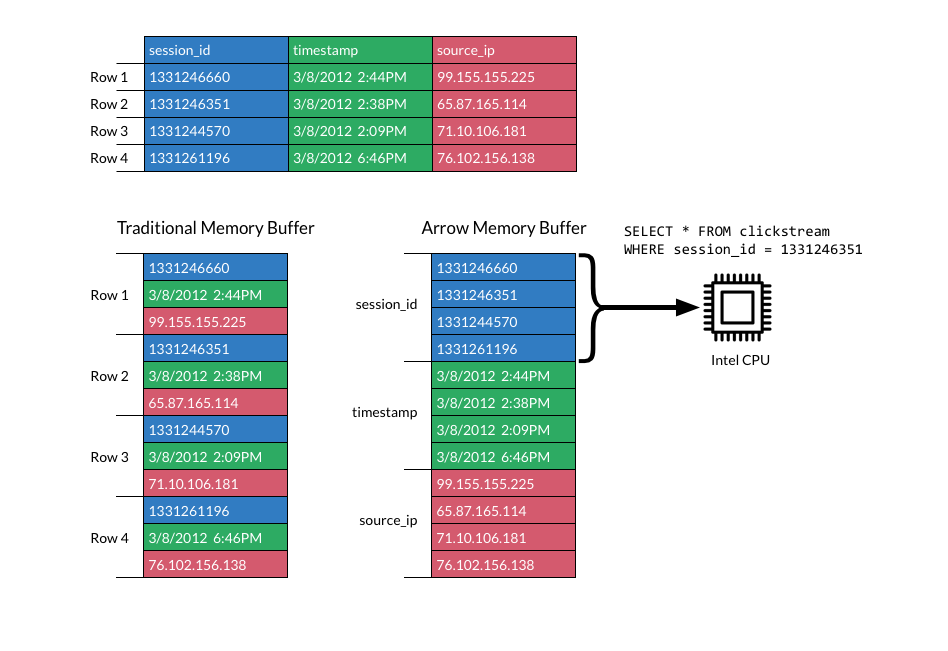

# chunk内存优化 

* 使用类似apache arrow的内存列式存储，减少内存使用
* 数据读取next的时候，从之前一条条读改为批量读取

>> TiDB 2.0 中，我们引入了一个叫 Chunk 的数据结构用来在内存中存储内部数据，用于减小内存分配开销、降低内存占用以及实现内存使用量统计/控制

>> Column 的实现参考了 Apache Arrow

>> arrow 提供了一种跨平台应用的内存数据交换格式

[Tidb Chunk 和执行框架简介](https://zhuanlan.zhihu.com/p/38095421)

[apache arrow 内存数据结构](https://www.cnblogs.com/smartloli/p/6367719.html)
