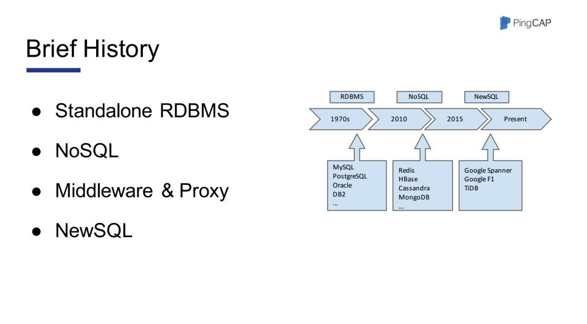

# why tidb

## tp

关于数据库发展的历史，如图一所示在早期，大家主要是使用单机数据库，如Mysql等。这些数据库的性能完全可以满足当时业务的需求。但是自2005年开始，也就是互联网浪潮到来的时候，这些早期的单机数据库就慢慢开始力不从心了。当时Google发表了几篇论文，谈论了其内部使用的Bigtable Mapreduce。然后就有了Redis、HBase 等非关系型数据库，这些数据库实际上已经足以满足当时业务的需求。

直到最近的五六年，我们发现尽管各种NoSQL产品大行其道，但是Mysql依然是不可或缺的。即使是Google，在某一些不能丢数据的场景中，对一些数据的处理依然需要用到ACID，需要用到跨行事务。因此Google在12年的时候发表了一篇名为《Google Spanner》的论文(注：Spanner是在Bigtable之上，用2PC实现了分布式事务)。然后基于Spanner，Google的团队做了F1(注：F1实际上是一个SQL层，支持SQL的语法)，F1用了一些中间状态来屏蔽了单机Mysql可能碰到的阻塞的场景。

## ap

spark sql + thrift server ==> kudu ==> cockroachdb ==> tidb

* spark sql + thrift server 跑批强悍，但频繁查询的场景满足不了
* kudu 底层也是raft + lsm ，遇到的问题是region数量，sql支持依赖impala
* cockroach 啥都好，还json支持非常好；but ... join性能差，使用PostgreSQL

