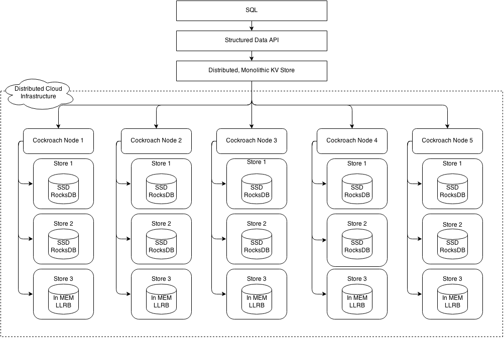

## why tidb

### tp

关于数据库发展的历史，如图一所示在早期，大家主要是使用单机数据库，如Mysql等。这些数据库的性能完全可以满足当时业务的需求。但是自2005年开始，也就是互联网浪潮到来的时候，这些早期的单机数据库就慢慢开始力不从心了。当时Google发表了几篇论文，谈论了其内部使用的Bigtable Mapreduce。然后就有了Redis、HBase 等非关系型数据库，这些数据库实际上已经足以满足当时业务的需求。

直到最近的五六年，我们发现尽管各种NoSQL产品大行其道，但是Mysql依然是不可或缺的。即使是Google，在某一些不能丢数据的场景中，对一些数据的处理依然需要用到ACID，需要用到跨行事务。因此Google在12年的时候发表了一篇名为《Google Spanner》的论文(注：Spanner是在Bigtable之上，用2PC实现了分布式事务)。然后基于Spanner，Google的团队做了F1(注：F1实际上是一个SQL层，支持SQL的语法)，F1用了一些中间状态来屏蔽了单机Mysql可能碰到的阻塞的场景。

### ap

spark sql + thrift server ==> kudu ==> cockroachdb ==> tidb

* spark sql + thrift server 跑批强悍，但频繁查询的场景满足不了
* kudu 底层也是raft + lsm ，遇到的问题是region数量，sql支持依赖impala
* cockroach 啥都好，还json支持非常好；but ... join性能差，使用PostgreSQL语法

#### kudu

#### cockroach

## tidb architecture

我们日常说的tidb其实是包含3大组件： tidb、pd、tikv。

* `tidb`: 负责sql解析、计算；golang实现
* `pd`: 负责kv的调度，统一授时；golang实现
* `tikv`: 基于raft实现的统一kv存储；数据最终存储的地方；rust实现

### tikv

换个大家熟悉的角度看

Tikv简单说，就是使用raft在单机rocksdb的基础上，做一个分布式的kv存储。以region为单位对数据分组后，通过raft保证数据的外部一致性。

Tikv 跟pd的关系： Tikv主动上报tikv实例信息、每个raft组的信息给pd，pd只是接收。

TiKV 也是一个非常复杂的系统，这块我们会重点介绍，主要包括：

* Raftstore，主要是Raft的实现，包括 Multi-Raft。是etcd版raft使用rust实现的一个版本。
* Storage，Multiversion concurrency control (MVCC)，基于 Percolator 的分布式事务的实现，数据在 engine 里面的存储方式，engine 操作相关的 API 等。
* Server，TiKV 的 gRPC API，以及不同函数执行流程。
* Coprocessor，TiKV 处理 TiDB 的下推请求，如何通过不同的表达式进行数据读取以及计算的。
* PD， TiKV 跟 PD 进行交互。
* Import， TiKV 处理大量数据的导入，以及跟 TiDB 数据导入工具 lightning 交互的。
* Util， TiKV 使用的基本功能库。

### pd

PD 用来负责整个 TiKV 的调度，我们会详细的介绍 PD 内部是如何使用 etcd 来进行元数据存取和高可用支持，也会介绍 PD 如何跟 TiKV 交互，如何生成全局的 ID 以及 timestamp。

最后，我们会详细的介绍 PD 提供的 scheduler，以及不同的 scheudler 所负责的事情，让大家能通过配置 scheduler 来让系统更加的稳定。

[Go 在 TiDB 的实践](http://www.sohu.com/a/220085058_657921)

[kudu overview](https://kudu.apache.org/overview.html)

[Kudu:支持快速分析的新型Hadoop存储系统](https://bigdata.163.com/product/article/1)

[TiKV 源码解析系列文章（一）序](https://pingcap.com/blog-cn/tikv-source-code-reading-1/)